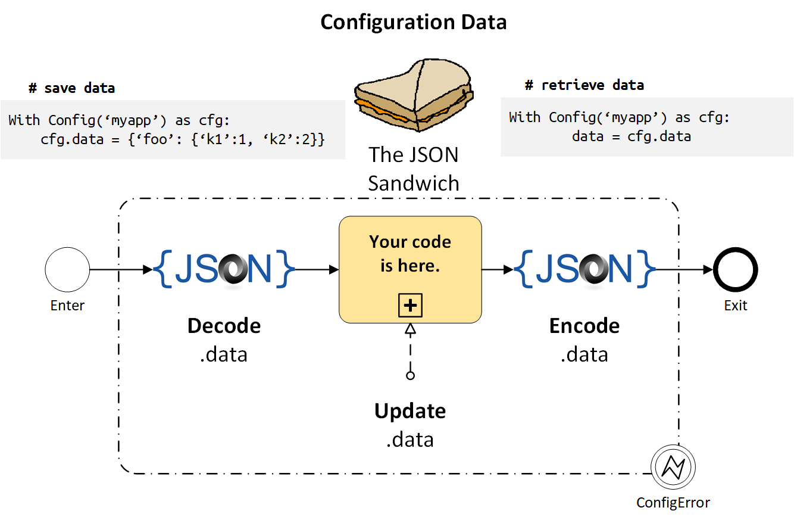

#################
The JSON Sandwich
#################

.. code::

    from jsonconfig import Config

    with Config('myapp') as cfg:
        cfg.data = {'debug': True}

*Configuration data is stored in the context manager's `data` attribute*.

`cfgfile` is the filename; see the Configuration File Locations section to
learn how it's constructed:

.. rubric:: Your data is in the middle of the sandwich ...

1. **ENTER**: ``.data = json.load(cfgfile)``
2. *your code is here*
3. **EXIT**: ``json.dump(cfgfile, .data)``

That's really all there is to it.

The Config context manager's `mode` parameter determines whether the
sandwich bread on the top, bottom, neither or both top & bottom.

None
    No access.  Skip step 1 & 3.  Do not read or write the data and do not
    expose the `data` attributed.  This is useful is you are only interested
    in encrypted data and/or environment variables.

    .. code::

        with Config('myapp', None) as cfg:
            pass

r 
    Read-only mode.  Skip step 1, set `data = {}`.  Of course you can
    overwrite the data with any JSON serializable object, or apply one
    of Boxes data access wrappers, but by default it is a standard Python
    dict.

    .. code::

        with Config('myapp', 'r') as cfg:
            configuration_data = cfg.data

w 
    Write-only mode.  Skip step 3.  You update the data and it will
    serialize it as JSON and save it to the config file.

    .. code::

        with Config('myapp', 'w') as cfg:
            cfg.data = {'debug': True}

\+
    Read & write mode.  This is the default.  JsonConfig reads in your
    data and takes a snapshot (deepcopy) of it.  You then update the
    data and then when it exits in step 3 (the context manager's __exit__
    method) it will compare the current `data` contents to the snapshot;
    if the data changed it will serialize the contents of the `data`
    attribute and save it to the configuration file.

    .. code::

        with Config('myapp') as cfg:
            cfg.data.update({'width': 80})

.. note::

    The above rules and automatic JSON encoding and decoding only apply to
    the `data` attribute.

    The `pwd` (encrypted data) and `env` (environment variables) are updated
    as soon as you set them and retrieved on demand; they are strings by
    default. If needed, they can optionally be serialized as JSON using the
    to_json and from_json helper functions.

.. topic:: All about Python context managers ...

    * https://dbader.org/blog/python-context-managers-and-with-statement
    * https://pymotw.com/3/contextlib/
    * https://jeffknupp.com/blog/2016/03/07/python-with-context-managers
    * http://book.pythontips.com/en/latest/context_managers.html